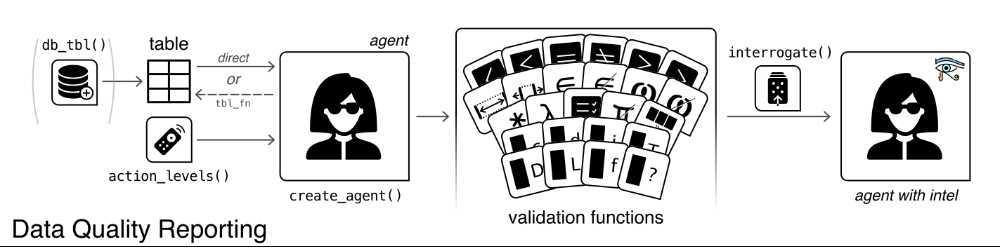

```{r setup, include=FALSE}
  knitr::opts_chunk$set(echo = TRUE, eval=F)
  library(tidyverse)
```

# Day's objectives

-   Understand workflow, why it is important, and how to do it using Rstudio/R
-   Have an understanding of the tidyverse framework and its key packages
-   Provide a bit of context/framework to working in R as many of us have learned piecemeal
-   Work through an example

# Key packages

{width="10%"} {width="10%"} {width="10%"} {width="10%"} {width="10%"}

# Workshop project: Wetland Data

```{r dwnldProject_day1, eval=T, echo=FALSE, code_folding = FALSE}
library(downloadthis)
  download_link(
    link="https://delwpvicgovau-my.sharepoint.com/:u:/g/personal/ben_fanson_deeca_vic_gov_au/EfZB-ZZBg8FDs0LNsHfz5kABx0Wc2Gf9_WRNmBaj74rLaQ?e=M5yhq6",
    output_name = "dataProject",
    button_label = "Download project data",
    button_type = "warning",
    has_icon = TRUE,
    icon = "fa fa-save"
  )
```

# Workflows

## Examples of workflows

### mine

### Paul's

### Commonalities

## Advantages of workflow

### "Laziness" in data analysis programming

A crucial attribute of workflow is "laziness". As several of you will know, I will often say that I am "lazy" in my programming. I do not want to think about coding anymore than have to. I have a set workflow that I basically always follow as I showed above as well as set programming style. I want to spend my time thinking about science (and statistical models), not programming.

There are two distinct advantages to this:

-   reduce cognitive load
    -   we have limited working memory. A workflow minimizes wasted time on the logistics of the analysis (how to set up folder, naming of files, naming of variables, how the analysis will be structured).
-   distraction from the analysis by coding
    -   distraction theory - average focus time is 4 min
    -   if I have a set routine, I can go into automatic mode and can efficiently
    -   more you have to break away from this routine (deep focus), higher the chance of going down rabbitholes (or check that email)

# Rstudio

You can find a variety of cheatsheets at <https://posit.co/resources/cheatsheets/>

<aside>See Rstudio IDE to Positron <https://github.com/posit-dev/positron/wiki> for note about new IDE</aside>

## Basics

-   assume familiar with
-   might want to turn off .Rdata so everything is fresh on startup (no issues with previous objects so completely reproducible)
-   

## Tips and tricks

-   tab
-   fills in paths
-   hexcode color coating
-   code folding (\#)
-   insert pipe: ctrl+shift+M %\>%
-   comment: ctrl + shift + C
-   find in all files
-   click on object in "Data" to view and filter the dataset

# Setting up Rproject

## Rproject

## Project directory/folder structure

# Version Control: Git/Github [Advanced]

As part of my due-diligence, I have to mention version control. In short, version control is external software that keeps track of all your changes (so you can go back if something breaks in your code) and very helpful with collaborations (e.g. allowing you both code away and then merging those changes).

For R/Rstudio, Git/Github is the most popular. Now, **Git is the version control software locally on your computer** and it does the tracking of all changes In contrast, **Github is an online platform** in which you can upload those changes (and project folder/files) and is mainly useful for the collaboration/sharing (plus some other useful features)

**Key points on Git/Github:**

-   If not collaborating, the overhead of Git (learning, initial setup, random breaks) might not worth it to you. You still have version histories via Onedrive to save you (not as easy to shift through as Git).

-   If collaborating, it really is the best approach that will save you effort in the long run.

-   It is worth playing around with Github online so you know how to navigate the website (this workshop will help with that). Github is a rich resource with example code and useful packages not on CRAN. Github project (aka repositories) can look intimidating at first.

-   Rstudio has git integration that makes it easier to work with, though the github desktop

-   Github has Github pages which is hosting this website [workflow: 1) write RMD files in Rstudio; 2) upload to Github; 3) Github publishes at <https:username.github.io/project_id>]

**GIT resources to get started**

Cheatsheet: <https://rstudio.github.io/cheatsheets/git-github.pdf>

Useful book with R focus: <https://happygitwithr.com/>

# Programming good technique

-   consistent style
-   modularize your code (functions - slightly more advanced)

# Help!!!!!!!!

When learning and using R, you will get stuck and need help. There are variety of help sources we use on a daily basis.

1.  Built-in to Rstudio are help files. This provides an initial starting place if you are interested in how to use a specific function. You just need to put "?" before the function and press run: `?mean()` or use the `Help` tab

2.  Google search (e.g. stackoverflow, blogs) can be really helpful for finding new functions, packages, etc.

3.  Biometrics - happy to provide guidance/tips/thoughts

4.  ARI's QEARI - hacky hour or Teams chat

5.  AI is becoming more and more useful [I am finding the most useful]

## Using AI for coding

A few AI I use regularly:

-   **Copilot (Microsoft)**: allrounder AI which we have a free subscription at ARI. It does a decent job [I use this one daily]

-   **ChatGPT**: another allrounder similar to Copilot

-   **Claude**: prefer this one for writing text but seems to work well too

For this workshop, I will stick to **Copilot** given the accessibility for everyone.

For those not regularly using AI, there are a few things that can help when running your searches for help:

-   when asking for an example, include lots of specific to get closer to what you want. You may want to tell it to use only tidyverse functions for the example code. I often ask it to use a built-in dataset for the example so that I can check it right away.

-   Experiment and Iterate: Don't be afraid to experiment with the code generated by AI. Modify it, run it, and see what happens. If something is not working, you can ask point out the error and see if it can fix it

-   Use AI for Debugging: If you encounter errors, AI tools can help you debug your code. They can suggest fixes and optimizations, making the debugging process less daunting.

# Tidyverse framework

{width="10%"}

## Historical context

-   base R [the packages included when you install R the first time]
-   `base`, `stats`, `grid`, `utils`, ...

```{r base_r, eval=F}
# example of getting a plot using base
  ds <- mtcars  # grab the built-in mtcars dataset
  ds <- ds[, c('mpg','hp')]   # select just the columns you want
  ds$l_100km <- 1/( ds$mpg/3.78 * 1.6 )*100 # convert mile per gallon to liters / 100km
  plot( ds$l_100km ~ ds$hp )  # plot relationship between horsepower and km/l

```

-   quirky things about R: factors vs character, NAs,

-   lubridate fixed date quirks

-   lack of consistency within base and between packages

-   data argument might be first or last

## Basic principles

-   human-centered

    -   readable to humans

    -   uses verbs like `mutate`, `select`, `filter`, `summarise`

    -   uses sentence like structure: noun -\> verb -\> verb [ Paul -\> walks (to work) -\> sets up ( his computer) -\> creates a plot -\> saves plot (to a file) -\> calls it day -\> walks (home) ]

-   consistent

    -   when using tidy functions, you get consistent output data structure (called a tibble)

```{r  eval=F}
  # an example of tidyverse consistent structure
  class(mtcars)   # data.frame
  head(mtcars)    # notice the rowlabels
  View(mtcars)    # see the rownames in the spreadsheet
  as_tibble(mtcars,rownames = 'make')  # tidyverse datasets (tibbles) never have rownames

```

-   

-   composable (chunks)

## Tibbles

-   I mentioned briefly above about "tibbles"

    tibble is data.frame v2.0

    -   better printing of the data
    -   handles some of the quirky things that caught up people
    -   column names

## Pipes: %\>% (magittr package)

A key component of tidyverse world is the concept of "pipes". The pipe connects multiples steps into a single sequence of commands.

<aside>Just to make things harder, a new pipe `|>` has been introduced. It is very similar to `%>%` but it does act a little different. We will just teach `%>%` because we are set in our ways</aside>

### Building "sentences"

```{r, eval=F}
  library(tidyverse)
  head(mtcars)
  mtcars %>% head(10)  # get mtcars, pass to head function, take the first 10 rows
  
# sentence using tidy functions we will dive into below...just follow basic logic
  mtcars %>% 
    slice_head(n=10) %>%  # take first 10 rows   
    mutate( mpl = round( mpg/3.79,2 ) ) %>%  # convert mpg to miles per liter (mpl)
    select( mpg, mpl )  # keep just the mpg and mpl columns 

# placeholder "."
  mtcars %>% head(5)    
  mtcars %>% head(.,5)  # same as above but explicitly using . to denote the input

  # example where you want to input the dataset not into first argument spot
  mtcars %>% lm(mpg~hp) %>% summary()  # fails as it is trying lm(formula=mtcars, data=mpg~hp )
  mtcars %>% lm(mpg~hp, data=.) %>% summary()  # referencing the input by "."

```

### "Odd" looking uses

With `%>%` it is worth being aware that you will see different variations that look odd. I show a few examples below.

<aside>Note that you can have different variations using `%>%` that might look odd. E.g. `data %>% head` or `data %>% .$var`. Just be beware</aside>

```{r eval=F}

  mtcars %>% head  # lack of brackets
  mtcars %>% head(n=3) %>%  bind_rows( ., .)   # multiple "." example
  mtcars %>% .$mpg   # grabs a specific column - combining tidyverse with base approaches 
  mtcars %>% {c( mean=mean(.$mpg), median=median(.$mpg) ) }  # curly bracket example using "." and $ - prevents putting . into c(., mean(.$mpg), median(.$mpg))


```

### old vs. new: %\>% vs. \|\>

\|\> is considered to be "simple" now compared to %\>%

are some differences mainly associated with referring to the passed

Tip - set a shortcut for... Ctrl-Shift-M

```{r , eval=F}
  library(tidyverse)
  head(mtcars)
  mtcars %>% head()
  mtcars |> head() # newer version 

# examples of differences (advanced)
  mtcars %>% head # works
  mtcars |> head  # fails  (must have brackets)
  mtcars |> head()  # works  (must have brackets)

  #subselecting
  mtcars %>% .$mpg
  mtcars |>  .$mpg  # $ not supported
  mtcars |>  pull(mpg)  # use pull

  mtcars %>% head(x=., 10) # . works for %>% 
  mtcars |>  head(x=., 10)  # . placeholder does not work
  mtcars |>  head(x=_, 10)  # _ placeholder instead
  mtcars |>  head(n=10, x=_)  # _ placeholder instead
  mtcars  %>%   head(n=10, .)  # can place without argument specified
  mtcars  %>%   head(n=10, _)  # must you argument if not in first position

    
```

# Importing

## Saving the data files

## Excel files

{width="10%"}

Key functions

```{r eval=F}
  readxl::read_xls()
  readxl::read_xlsx()
```

Tips and tricks

-   NAs - defining

-   rename columns

-   reading in more rows to get column type correct

-   setup excel file to have NA

```{r import_excel, eval=F}
  readxl::read_xls()
  readxl::read_xlsx()
```

## CSV/Table

{width="10%"}

```{r import_readr, eval=F}
#
  readr::read_csv()
  readr::read_table()

# brings in as tibble  
  ds_base <- read.csv('data/raw/mtcars.csv')  
    head(ds_base)
    class(ds_base)

  ds_tidy <- read_csv('data/raw/mtcars.csv')  
    head(ds_tidy)
    class(ds_tidy)
  
```

## Database (Advanced)

Some possible packages to check:

-   `RMySQL`: This package allows you to connect to MySQL databases and execute SQL queries1.
-   `RPostgreSQL`: This package is designed for connecting to PostgreSQL databases1.
-   `RSQLite`: This package is used for SQLite databases and is great for lightweight, serverless database applications1.
-   `RODBC`: This package provides a way to connect to any database that supports ODBC (Open Database Connectivity)1.
-   `RJDBC`: This package uses Java Database Connectivity (JDBC) to connect to a wide variety of databases1.

## column names

-   what makes a good column name
-   no whitespaces, no special characters, not too long, (for me) all lowercase
-   prefixes or suffixes (useful for select functions)

```{r eval=F}
  warning('create example excel file in')
  ds <- tibble::tibble(`First column`=1:5, `% column`= runif(5) )
  janitor::clean_names( ds )

```

## empty rows

```{r janitor_clean, eval=F}

  ds <- tibble::tibble(`First column`=c(1:5,NA), `% column`= c(runif(5),NA ), final=c() )
  janitor::remove_empty( ds )

  janitor::remove_empty( ds ) %>% 
      janitor::clean_names(  )

  
```

## Advanced topic(s)

### Importing lots of files with same (or similar-ish) structure

There are times that you will want to import 10s or 100s of files that are structurally the same (e.g. camera data, acoustic tagging data). I use the `purrr` package on almost daily basis. This package was created to help simplify the `apply` family of functions (e.g. `apply`,`lapply`,`sapply`,`mapply`) into a more intuitive nomenclature (like the rest of tidyverse). One website that gives a tutorial is <https://jennybc.github.io/purrr-tutorial/> (but several others out there).

```{r import_multi, eval=F}

  v_list <- dir('data/raw/tagging',full.names = T)   # get a list of files to import.  use full.names=T to relative path
  importData <- function(x) read_csv( x ) %>% mutate(file_id=x) # create the function that imports a single file
  ds_all <- purrr::map_df( v_list, ~importData(.x) )   # loop through each filename in v_list, combine together into new dataset

```

Note - you could do this using for-loops but it takes more code.

### Excel files and importing color metadata

First off, **just don't use cell styles (color)** in excel as a way to store data. For instance, using color to indicate treatment.

That being said, you can extract that information using `tidyxl` package. I have had good luck with

## Hands-on

After setting up the folder structure for your project, you need to add your data. Here, you will download the `data/` directory using link below:

```{r dwnldData, eval=T, echo=FALSE, code_folding = FALSE}
library(downloadthis)
  download_dir(
    path='data',
    output_name = "dataProject",
    button_label = "Download data folder for project",
    button_type = "warning",
    has_icon = TRUE,
    icon = "fa fa-save"
  )
```

After the zip file downloads, unzip and drag the `data/` folder to your Rproject folder.

XXXX data/raw, data/rds, data/spatial XXXX

::: {#task_import .greeting .message style="background: lightgrey;"}
**Your Task**

Import your data

-   Call the Rproject `projectDADA`
-   Create subfolders: `data/`, `R/`
-   Create a new r script calls `importData.r` and save in `R/` folder
-   
:::

# Data cleaning

-   any useful packages that show this information in condensed way

## checking your data - each column

-   reminder on factor vs character
-   ordering factors
-   forcats

## know the design so you can check for issues

## notes on missing values

-   reminder of different ways to handle

-   run model, will be dropped

-   causes errors (NA) in summary (na.rm=T, do not do as a default)

-   

    # Dealing with NA

## NA and NaN in R

-   unique
-   0/0
-   as.character( c(NaN, 1) )
-   as.character( c(NA, 1) )
-   n_distinct( c(NA,'a','b') )

## other similar values: NaN, Inf

1/0

## useful functions

is.na(), is.Nan(), is.Inf()

## NAs in other functions

-   mean( na.rm=T)

-   rolling()

-   statistical models regression example

a)  options: delete explicitly (missing at random), imputation techniques (mean)

## 

# 

# Joins

{width="10%"}

```{r cheatsheet, out.width='100%', out.height='200%'}
```

knitr::include_graphics("dplyr.pdf")

<br> <br> <br> <br> <br> <br>

Note: joins = merges (synonyms)

## Project step

asdf

## types of joins

-   `left_join`  - the most useful join (and safest)

-   `right_join` - I never use...just use `left_join`

-   `full_join` - I find this to be a special use

-   `inner_join` - can be useful with caution

## Tips and tricks

-   Essential to make sure that the number of rows out matches your expectation
-   Almost all my joins are

::: {#task_join .greeting .message style="background: lightgrey;"}
**Your Task**
:::

# Restructuring

{width="10%"}

```{r cheatsheet, out.width='100%', out.height='200%'}
```

knitr::include_graphics("tidyr.pdf")

<br> <br> <br> <br> <br> <br>

::: {#task_shape .greeting .message style="background: lightgrey;"}
**Your Task**
:::

# String manipulation

{width="10%"}

```{r cheatsheet, out.width='100%', out.height='200%'}
```

knitr::include_graphics("stringr.pdf")

<br> <br> <br> <br> <br> <br>

::: {#task_str .greeting .message style="background: lightgrey;"}
**Your Task**
:::

# Date/time

{width="10%"}

```{r cheatsheet, eval=T, out.width='100%', out.height='200%'}
  knitr::include_graphics("lubridate.pdf")
```

<br> <br> <br> <br> <br> <br>

## Key date concepts

### date using lubridate

```{r dt_basic, eval=F}

# tidy way to make a date
  as_date('2001-01-01') # assume Year-month-day
  ymd('2001-01-01')  # better to be specific using helper function
  dmy('01-01-2021') # date the other way
  
# dates are stored as number of days since 1970-01-01 (julian days) in R 
  dt <- as_date('1970-01-01')
  class(dt)
  as.numeric(dt)  # days since 1970-01-01 is zero
  as_date('2024-01-01') %>% as.numeric() # 19,723 days since that reference date
  
# EXCEL WARNING: dates are stored as number of days since 1899-12-30 in Excel [leap year bug in Lotus]
  ds <- readxl::read_excel('data/raw/date_example.xlsx') %>% select( starts_with('dt_') )
  head(ds)  # notice the mix of numbers and text...[reminder: databases as so much better than excel]
            # notice the <s3: POSIXct> column type
  ( v_dt <- slice_head(ds, n=4 ) %>% pull(dt_excel) %>% as.numeric() )
  as_date(v_dt)  # obviously wrong because it is using 1970-01-01 as the reference date
  as_date(v_dt,origin='1899-12-30') 
  
  # switch from POXICxt to Date
  mutate(ds, dt_correct = as_date(dt_correct) ) # now it is <date>
  
  # for those interested, one possible fix to the column
  mutate(ds, dt_fixed = case_when( !is.na(as.numeric(dt_excel)) ~ as_date( as.numeric(dt_excel), origin='1899-12-30'),
                                   TRUE ~ dmy( dt_excel)  ) )
  # what does AI do? Try "using tidyverse in R, how can I fix a dataset that has a column that is text that needs to be converted to date but the column has julian days as well as date character formats in it?"
  
```

<br>

```{r dt_helpers, eval=F}
# lots of useful date helpers in lubridate  
  dt <- as_date('2024-09-16')
  year(dt)  # year
  month(dt) # month
  week(dt)  # week in the year
  wday(dt)  # day in the week (monday=2)
  yday(dt)  # day in the year
  leap_year(dt)  # is this year a leap year?
  
#   
  
# tip using built in month vectors
    month.abb[ month(dt) ] # example to get the month abbreviation
    month.name[ month(dt) ] # example to get the month fullname

  
```

### lubridate vs. base

Of course, there was a base way of making `as.Date()`. `as_date()` was created to fix a few pitfalls with as.Date(), so it is safer/better to just use `as_date()`

```{r dt_base_tidy, eval=F}
# tidy vs base...  
  as_date('01-11-2021')  # gives error - tidyverse
  as.Date('01-11-2021')  # note the issue - base R

# note assumptions still happen but tidy is a bit safer  
  as_date('01-01-01') # assumes Year-month-date and that we are 20XX
  as.Date('01-01-01') # no chance of correct
  
  dmy('01-11-2021')  # can you the helper functions to convert
  as_date('01-11-2021', format='%d-%m-%Y') # or add a format for those inclined
  ?strptime  # one place to find format codes
  # copilot - try "what is the date format code for 01-nov-2022 using R"  
  
# timezone stuff-ups  
  dt_utc <- ymd_hms("2024-09-01 00:50:50")
  dt_europe <- ymd_hms("2024-09-01 00:50:50", tz = "Europe/London")
  c(as_date(dt_utc), as.Date(dt_utc))
  c(as_date(dt_europe), as.Date(dt_europe) )

  as.Date(dt_europe, tz= tz(dt_europe) ) # have to grab the tz explicitly
  
  
```

## Key datetime concepts

It is very analagous to date concepts so let's mirror our previous steps

```{r dt_basics}

# tidy way to make a datetime
  as_datetime('2001-01-01 10:00:00') 
  ymd_hms('2001-01-01 10:00:00')  # better to be specific using helper function
  dmy_hm('01-Nov-2001 10:00')  # better to be specific using helper function

# dates are stored as number of seconds since 1970-01-01 00:00:00 in R 
  dttm <- ymd_hms('1970-01-01 00:00:60')
  as.numeric(dttm)  # 60 seconds

# however, dates are stored as number of days since 1899-12-30 in Excel [leap year bug in Lotus]
  ds <- readxl::read_excel('data/raw/date_example.xlsx') %>% select( contains('tm_'))
  head(ds)  # notice the mix of numbers and text...[reminder: databases as so much better than excel]
            # notice the <s3: POSIXct> column type
  ( v_dt <- slice_head(ds, n=4 ) %>% pull(dt_excel) %>% as.numeric() )
  as_date(v_dt)  # obviously wrong because it is using 1970-01-01 as the reference date
  as_date(v_dt,origin='1899-12-30') 
  
  # switch from POXICxt to Date
  mutate(ds, dt_correct = as_date(dt_correct) ) # now it is <date>
  
  # for those interested, one possible fix to the column
  mutate(ds, dt_fixed = case_when( !is.na(as.numeric(dt_excel)) ~ as_date( as.numeric(dt_excel), origin='1899-12-30'),
                                   TRUE ~ dmy( dt_excel)  ) )
  # what does AI do? Try "using tidyverse in R, how can I fix a dataset that has a column that is text that needs to be converted to date but the column has julian days as well as date character formats in it?"
  
```

# Saving the clean data

At the end of the import and clean stage, I save the dataset as an RDS file.

```{r}
# to save an RDS file
  saveRDS( list(), 
          'data/rds/ards_main.rds')  # ards = Analysis-ready dataset

# to read an RDS file
  readRDS('data/rds/ards_main.rds')

```

# Revisiting day's objectives

-   Understand workflow, why it is important, and how to do it using Rstudio/R
-   Have an understanding of the tidyverse framework and its key packages
-   Provide a bit of context/framework to working in R as many of us have learned piecemeal

# Advanced topics

## Quality check packages

If you know that you will be updating the import of files repeatedly, it can be worthwhile to do some upfront QC/QA checks to ensure that the data coming in is clean. There are some packages to help with that. There is a bit of overhead in both learning the package and implementing.

## `validate` package

The validate package is intended to make checking your data easy, maintainable, and reproducible. A few of the attributes:

-   test data against a reusable set of data validation rules

-   investigate, summarise, and visualise data validation results

-   import and export rule sets from and to various formats

-   filter, select and otherwise manipulate data validation rules'

-   investigate, summarise, and visualise rule sets

## `pointblank` package

```         
*According to package it can methodically validate your data whether in the form of data frames or as database tables. On top of the validation toolset, the package gives you the means to provide and keep up-to-date with the information that defines your tables.*

I have used before but
```



## Big Data

When data starts to get big (millions of row), tidyverse can struggle with speed. This is huge topic but will direct you to a couple useful packages that allows you to just learn dplyr but use other quicker processes

-   `dtplyr` [package](https://dtplyr.tidyverse.org/)

-   under the hood it uses the `data.table` [package](https://cran.r-project.org/web/packages/data.table/vignettes/datatable-intro.html)

-   but you write code in tidy/dplyr

-   `dbplyr` [package](https://dbplyr.tidyverse.org/) if working with a database

    -   has the database do all the processes and return the result back to R
    -   takes advantage of cloud computing

# Hands-on component

```{r dwnldProject_hands, eval=T, echo=FALSE, code_folding = FALSE}
library(downloadthis)
  download_link(
    link="https://delwpvicgovau-my.sharepoint.com/:u:/r/personal/ben_fanson_deeca_vic_gov_au/Documents/Documents/Projects/workshop/day1_project.zip?csf=1&web=1&e=SWIn8S",
    output_name = "day1Project",
    button_label = "Download Rstudio project",
    button_type = "warning",
    has_icon = TRUE,
    icon = "fa fa-save"
  )
```

::: {#task_rproj .greeting .message style="background: lightgrey;"}
**Your Task** Setup an Rproject for the workshop study

Bring in the second data file
:::

# Resources

Obviously, we have only scratched the surface of the topics here. Here are couple books I have used...

For a good e-book going into more details on the topics here (plus lots else)... [R for Data Science](https://r4ds.hadley.nz/)

For those wishing to up their game, see [Advanced R](https://adv-r.hadley.nz/)
