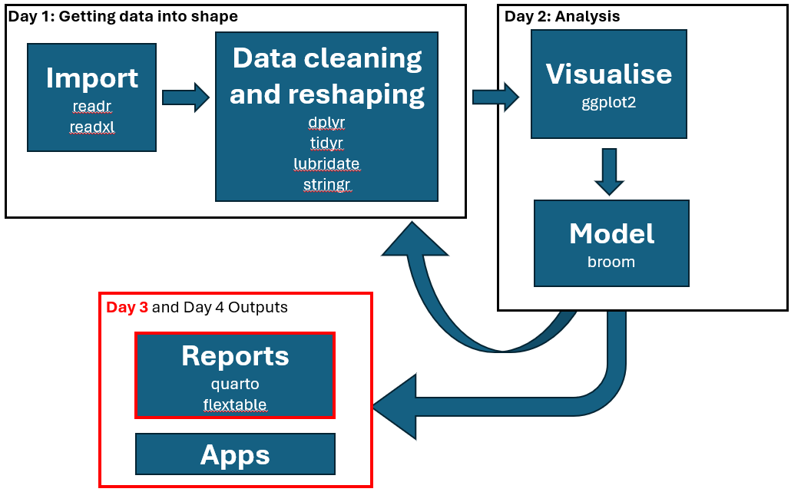
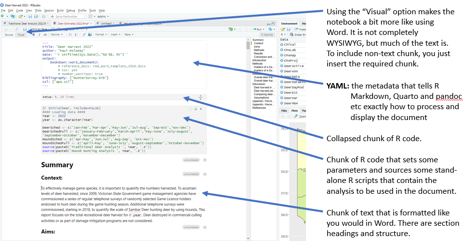
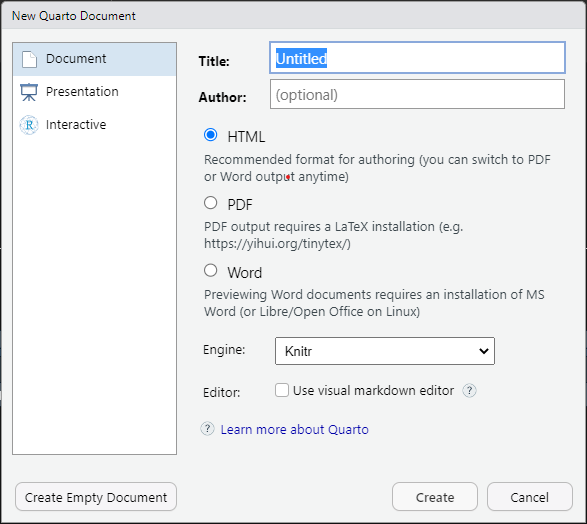
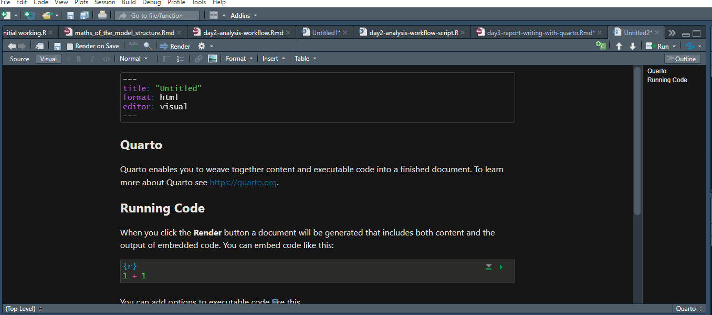

```{r include=FALSE}
knitr::opts_chunk$set(echo = FALSE)
library(tidyverse)
library(broom.mixed)
library(r2symbols)
library(flextable)

ari_theme <- function(x, ...) {
    # x <- colformat_double(x, big.mark = ",", decimal.mark = ".", digits = 1)
    x <- set_table_properties(x, layout = "fixed")
    x <- border_remove(x)
    std_border <- fp_border_default(width = 1, color = "black")
    x <- hline_top(x, part="all", border = std_border )
    x <- hline_bottom(x, part="all", border = std_border )
    x <- border_inner_h(x, border = std_border, part="body")
    x <- bg(x, bg='#004C97', part='header')
    x <- bg(x, j = seq(2, length(dim(x)$widths), 2), bg='#CCDBEA', part='body')
    x <- color(x, part = 'header', color = 'white')
    x <- bold(x, part = 'header')
    autofit(x)
}
```

```{cat, engine.opts = list(file = "color-text.lua")}
Span = function(el)
  color = el.attributes['color']
  -- if no color attribute, return unchange
  if color == nil then return el end
  
  -- transform to <span style="color: red;"></span>
  if FORMAT:match 'html' then
    -- remove color attributes
    el.attributes['color'] = nil
    -- use style attribute instead
    el.attributes['style'] = 'color: ' .. color .. ';'
    -- return full span element
    return el
  elseif FORMAT:match 'latex' then
    -- remove color attributes
    el.attributes['color'] = nil
    -- encapsulate in latex code
    table.insert(
      el.content, 1,
      pandoc.RawInline('latex', '\\textcolor{'..color..'}{')
    )
    table.insert(
      el.content,
      pandoc.RawInline('latex', '}')
    )
    -- returns only span content
    return el.content
  else
    -- for other format return unchanged
    return el
  end
end
```


[REMINDER TO US: START RECORDING!!!]{style="color: red;"}

```{r}
# just reading in some information for this webpage
ds_richness <- readRDS('data/ards_richness.rds') %>% filter(!is.na(native)) %>%
  mutate(visit = as.numeric(str_sub(survey_id, start = -1)) - 1)
tb_mod_spp <- readRDS('results/tb_mod_spp.rds')
pred_spp <- readRDS('results/pred_spp.rds')
```

# Day's objectives

-   Not being overwhelm with using code in a markdown setting
-   Being able to create a document in R through Quarto
-   Being able to use a Word template in Quarto
-   Being able to construct tables in R
-   Being able to use citations and references inside Quarto

# Key packages

{width="10%"}{width="10%"}{width="10%"}

# Project folder for today

```{r dwnldProject, eval=T, echo=FALSE, code_folding = FALSE}
library(downloadthis)
  download_link(
    link="https://delwpvicgovau-my.sharepoint.com/:u:/g/personal/ben_fanson_deeca_vic_gov_au/EbFW3NWZRmFJt4jP878aracB5ZuzaXdq41K6WnprG2B02A?e=EbQvXR",
    output_name = "day3Project",
    button_label = "Download Day 3 R project",
    button_type = "warning",
    has_icon = TRUE,
    icon = "fa fa-save"
  )
```


For background information on the dataset, see [dataset summary](https://bfanson.github.io/2024_DADA_workshop/dataset.html)

# Workflow

Reminder of our workflow...

{width="100%"}

# The pitch

::: {#spruik .greeting .message style="background: lightblue;"}
```{=tex}
\begingroup
\fontfamily{ppl}\selectfont
```
<font size="5">
<p class="blink">[So, you need to analyse some data and report on the results, including tables, figures and references?]{color="darkorange"}</p>
</font>

-   [Do you hate having to copy and paste the results from R, Python or SQL into Word?]{color="orange"}
-   [Do you need to produce a report or website with updated data and results on a regular basis?]{color="darkorange"}
-   [Do you want to produce an interactive document or dashboard?]{color="darkorange"}
-   [Has someone informed you that the analysis you just wrote up had some errors in the data and you need to rerun the analysis?]{color="darkorange"}

<font size="5">

<p class="blink">[Then maybe *Quarto* is for you!!!!]{color="darkorange"}</p>

</font> \endgroup
:::

# Why would I want to use something like *Quarto*?

The benefits of using something like *Quarto* is around closing the circle in your workflow when it comes to analysing data and producing documents with that data.

*Quarto* allows you to seamlessly integrate work from difference like `R`, `Python`, `SQL`, `Latex` and many other sources within the one notebook interface. It has the functionality to incorporate citations and change referencing systems easily. From one notebook, you can produce a Word document or a website.

The outputs could be documents (Word, PDF, HTML) presentations (PowerPoint, Beamer, Revealjs), websites, books/manuscripts or interactive displays (Shiny, widgets).

Your final output can contain formatted tables, figures, pictures, footnotes, citations, cross-references, all updated once the code is compiled. As part of your workflow, you can update reports easily, potentially with nothing more than updating the data and clicking the render button[^1].

[^1]: We are in no way liable for your words not matching the analysis output if the data changes

# What to expect when creating a report with *Quarto*

For those that are used to using Word and PowerPoint to create all their work documents, using a computational document can be a bit daunting. However, our goal today is to break the ice with using a mark-up language to creating a document. With *Quarto* and *RStudio* that task is a little easier.

## Don't panic

The first (and main) difference you will notice when you open a Quarto document is that there is *weird* coding bits here and there. Unlike Word and PowerPoint, Quarto is not **WYSIWYG** (*W*hat *Y*ou *S*ee *I*s *W*hat *Y*ou *G*et). We will use the **Visual** option that makes it a bit more like WYSIWYG, but not completely, as certain parts will only be converted once you render the file. To get the final version we need to compile the file.

{width="120%"}

## Workflow within *Quarto*

For each project where you want to create a document you follow a similar pattern.

1.  Open a file that uses the **.qmd** extension.
2.  Write the content with using the *Quarto* syntax.
3.  Embed *R* (or other) code that creates the output that you want to include in the report.
4.  Render the code, transforming the code into a slideshow, *pdf*, *html* or *Word* file.

# Creating a document using *Quarto*

## Starting a new *Quarto* document

The first thing that you want to do is open/create your project in *RStudio*. Then choose **File \> New file \> Quarto document...** from the menu to create a new **.qmd** file. You will need to chose what sort of document you want to create. The one we will create is "Document" (Figure \@ref(fig:createqmd)). This will create a Quarto script that includes some text and examples of how to create the document that you want.

```{r createqmd, echo=FALSE, include=TRUE, fig.cap="Screenshot of the pop-up window you need to use to create your Quarto script.", out.width="75%"}

```

The first thing you will notice (see Figure \@ref(fig:initialqmd)) is that unlike a *Word* document there is code and different coloured text, but this is not what the rendered document will look like, this is just the code to create the document. You will notice at the top of the page that there is some colourful text with names like "title" and "format" in between lines with three dashed. This is called the **YAML** and it sets the style and format of your document. The default YAML is written for us in the template. For the moment, change the title to something other than "untitled" and under that let's add "author: Your Name" with your actual name (rather than Your Name). Now press the **Render** button and it will render your document, with your new title and you as the author. Have a look at the *html* document produced and see the sort of things that can be included from *R* and Quarto.


```{r initialqmd, echo=FALSE, include=TRUE, fig.cap="Screenshot of the initial Quarto script.", out.width="75%"}

```


## Working with a pre-existing .qmd

Rather than working on this template let us break down the parts of the code by opening the file "wetland grazing.qmd". There is a lot of code, but this is basically a finished document (in terms of most coding anyway). After the YAML (which has more in it than before, which we will cover later) there is what we call a "chunk" of code. This is where we use our *R* code to edit data, run models and generally do all our *R* stuff. The first chunk is usually where we set-up the *R* environment by loading libraries and set defaults for the chunks.

<aside>
[Markdown basics](https://quarto.org/docs/authoring/markdown-basics.html)
</aside>

The structure of a chunk is that inside the braces ("{ }") you start with "r" (if it is an *R* chunk). Directly under that are usually the options you want for this chunk. Common options are:

| Name       | Description                                                                                                                                                                                                                                                                         |
|---------------|--------------------------------------------------------|
| echo       | Whether to display the code along with its results (default is TRUE)                                                                                                                                                                                                                |
| include    | Whether to display the results of the code (default is TRUE)                                                                                                                                                                                                                        |
| warning    | Whether to display warnings (default is TRUE)                                                                                                                                                                                                                                       |
| cache      | Whether to cache results for future renders (saves the results and uses them for later renders without re-evaluating them, default is FALSE). Can be useful if a chunk take a long to run, but can mean that if the data elsewhere is changed, it won't be reflected in this chunk. |
| fig-width  | Width in inches for plots created in the chunk (default is 7")                                                                                                                                                                                                                      |
| fig-height | Height in inches for plots created in the chunk (default is 7")                                                                                                                                                                                                                     |
| fig-cap    | The caption to be associated with this figure                                                                                                                                                                                                                                       |
| tab-cap    | The caption to be associated with this table                                                                                                                                                                                                                                        |
| label      | The name used to reference this chunk                                                                                                                                                                                                                                               |
|            |                                                                                                                                                                                                                                                                                     |
|            |                                                                                                                                                                                                                                                                                     |

: Common options for code chunks

[**NB:** If you want to be able to cross-reference your tables and figures etc, you need to follow the naming conventions, otherwise it will not be able to find the label and the cross-reference won't show up.]{color="blue"}

## Creating tables

To create a table in Quarto there are two main methods.

### Native to Quarto

You can insert a table using the **Insert \> Table...** option through the menu. You can select the dimensions of the table, if you want headers and if you want a caption. It then constructs that table, similar to a blank table in Word. You would then need to populate that table by hand. Maybe copy and paste will work, but the whole point of using something like Quarto is to not have to copy and paste data. The "Common options for code chunks" was constructed that way.

`r sym('medium-star')` `r sym('white-white-star')` `r sym('white-white-star')` `r sym('white-white-star')` `r sym('white-white-star')`

### Native to R

Alternatively, you could insert an `R` chunk, and import a table that way from your data. If you leave it at that you will have a very basic table entered that looks like the one below.


```{r tbl-bas}
#| label: tbl-basic
#| tbl-cap: A very basic table layout.

data.frame(Here = rpois(5, 3), There = rpois(5, 5))

```


If you want to produce a table that is ready to publish, then you could use a package like `flextable` or `gt` to get it looking nicer, with lots of options. The table below is an example of an ARI style table using `flextable`. If you are wanting to reference your tables, you will need to label them with the prefix "tbl-"

<aside>
[Here](https://ardata-fr.github.io/flextable-book/index.html) is more information on creating tables with `flextable`
</aside>


```{r}
#| label: tbl-spp-mod
#| tbl-cap: "Parameter estimates from the species richness model"

imp_spp <- (tb_mod_spp$conf.low*tb_mod_spp$conf.high > 0) & (tb_mod_spp$effect == 'fixed')
tb_mod_spp %>%
  select(-component) %>%
  mutate(across(where(is.numeric), ~ round(.x, 3)),
         effect = str_to_sentence(effect),
         effect = str_replace(effect, 'Ran_pars', 'Random')) %>% flextable() %>%
  set_header_labels(values = c('Effect', 'Grouping', 'Parameter', 'Estimate', 'S.E.', 'Lower', 'Upper')) %>%
  add_header_row(colwidths = c(5, 2), values = c("", "95% Credible bound")) %>%
  align( j=4:7, align='right', part='body' ) %>%
  bold(i = imp_spp) %>%
  ari_theme()

```

## Figures

### Inserting pictures

You can insert a picture by using the **Insert \> Figure/Image...** just like you would in Word. You can add a caption at that stage. To give it a label/ID select the "Attributes" button and type in a unique name that starts with "fig-" so that it know its a figure.

{width="40%"}

### Creating figures

If you want to construct a plot (say using `ggplot2`) you can do that via an `R` chunk. Insert the `R` chunk from the menu (**Insert \> Code Cell \> R**) and crate your figure from scratch. Use the code chunk to set the label so you can reference it later.

## Including citations

Citations can be inserted using the menu **Insert \> Citation...**. That will give you a pop-up window that will link to your Zotero account and other public reference source. If you start typing in the some information about the citation you are after, it will then search your reference list or search externally if you select that option. Selected citations will appear at the bottom of the pop-up window. Once you have the citations you are after, press *Insert* and they will be inserted into the notebook, as well as added to the `.bib` file for this project.

Alternatively, once you have some citations or your Zotero links, it you type "@" it will pop-up a window to search for citations from your list.

When you render the document, your citations (saved in the `.bib` file) will be sent to `pandoc` and any style you have selected will be applied. In the *YAML* you will see a line for the **cls** and the bibliography. Unless you want to attach a specific reference library, you shouldn't need to change that file name. The *cls* on the other hand can be changed easily to change the referencing style of the document.

<aside>You can search for publication styles [here](https://www.zotero.org/styles)</aside>


{width="40%"}

## Inserting footnotes

It is easy to insert a footnote, just use the menu to **Insert \> Footnote**. It will insert a number for the footnote and give a subtle pop-up for you to enter the text for that footnote. If you want to change the footnote, just click the number again.

## Dynamic text

You can insert dynamic text into your writing in-line, by pressing "\`" (shift+tilda) followed by r then your calculation followed by another "\`". This can be very useful when writing reports and you need to reference a statistic. If it changed, you don't need to go back and edit it, it will update it automatically when you render it again.

## Templates

If you want to customize the appearance of output into Word, Pandoc supports a special type of template called a reference document. To make Quarto use a specific reference document, it needs to be included in the *YAML*.

{width="100%"}

### Creating your own template

To create a new reference doc based on the Pandoc default, execute the following command:

> $ quarto pandoc -o custom-reference-doc.docx \
   --print-default-data-file reference.docx

Then, open custom-reference-doc.docx in MS Word and modify styles as you wish. You can open the Styles pane from the HOME tab in the MS Word toolbar. When you move the cursor to a specific element in the document, an item in the styles list will be highlighted. If you want to modify the style of any type of element, you can click the drop-down menu on the highlighted item. After you finish modifying the styles, you can save the document and use it as the template for future Word documents.

<aside>
[Word templates help](https://quarto.org/docs/output-formats/ms-word-templates.html)
</aside>