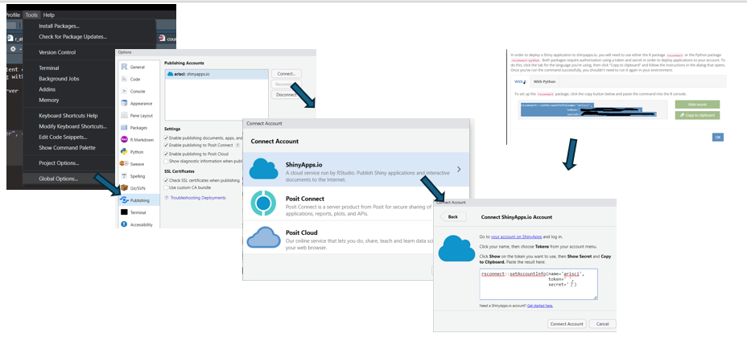

```{r setup, include=FALSE}
knitr::opts_chunk$set(echo = FALSE, collapse = TRUE)
```

# Day's learning objectives

1)  Have a good understanding of what Shiny apps can do and how it might be useful for you

2)  Understand the core structure of Shiny apps: UI, Server, Reactivity

3)  Learn how to create and run an App locally as well as deploy on ARI's shiny account

4)  **Feel confident enough to grab example code from Rshiny gallery** `r emo::ji('cross')`

# Key packages

{width="10%"} {width="10%"}

# Project for today

```{r dwnldProject, eval=T, echo=FALSE, code_folding = FALSE}
library(downloadthis)
  download_file(
    path='day4_project.zip',
    output_name = "day4Project",
    button_label = "Download Rstudio project",
    button_type = "warning",
    has_icon = TRUE,
    icon = "fa fa-save"
  )
```

Download from Onedrive: [day4_project.zip](https://delwpvicgovau-my.sharepoint.com/:u:/g/personal/ben_fanson_deeca_vic_gov_au/EUf4ChwggXVKiKAfPNKsyawBu05XOalYc-WnGQ0Wq3FjJw?e=BhpRiU)

# Pep talk

Okay, before we get started, I think that it is useful to give a pep talk. For the more programming-phobic of you, the Shiny code will look foreign. You first reaction might be "for f\*ksake, I am a researcher, not a programmer and I do not want to be programmer" and "are you serious after all this time I spent learning R coding and now I have to learn another type of programming??"

```{r shine_ex, include=T, echo=T,eval=F, collapse=T}
library(shiny)

# Define UI for application that draws a histogram
ui <- fluidPage(
  fluidRow( 
    selectInput('x','X-Variable', choices = names(mtcars)),
    selectInput('y','Y-Variable', choices = names(mtcars)),
    plotOutput('plot') 
)
)
# Define server logic required to draw a histogram
server <- function(input, output, session) {
  output$plot <- renderPlot({
    plot( mtcars[,input$x], mtcars[,input$y] )
    
  })
}# Run the application 

shinyApp(ui = ui, server = server)
```

But, we swear that it is not a bad at it looks. Once you get beyond the **foreignness of the code**, we guarantee that with a little guidance, you can easily get started making your own apps in minutes. It is just about **getting the basic structure** and then having the **confidence to do "trial-and-error"** with borrowed code. Just be forewarned, shiny Apps can become addicting!!!

# Let's build one together

## Go through a simple example

We will work through an example of building a simple app that displays a graph depending on the conditions selected. The example will demonstrate AI here...

## Walk through the key bits

### Setting up the app

{width="50%"}

For you app setup, you can either select a single file called `app.R` [like we did in the example] or you can create two files: `ui.R` and `server.R`. What this is doing is just breaking up the one file into two, otherwise basically the same. The advantage of the latter is in larger apps and for reusing code. We will stick with one file method for rest of today.

## Structure of the file

```{r file_str, eval=F}

# 1) Define extra packages and global objects (e.g. your dataset, model results, formats...)
library(shiny)
library(tidyverse)


# 2) Define UI for application [how it looks to the user]
ui <- fluidPage(    
  
)

# 3) Define server logic [steps taken when app starts and user clicks something]
server <- function(input, output) {
}

# 4) Run the application 
shinyApp(ui = ui, server = server)

```

Visual model of the file...

{width="50%"}

## UI (= user interface)

This is what the user will be using to explore your data/results/visualizations.

### Step 1: pick a layout

First step is determining what kind of layout you want. Single panel, main panel with sidepanel, tabs

XXXXXX CREATE IMAGE OF DIFFERENT LAYOUTS XXXXXXX

Of course the cheatsheet has some basic layout functions

{width="40%"}

### Step 2: create the inputs objects: buttons, inputs, drop-down menu

Once layout is figured out, now you add in the input objects. In our example that was a drop-down menu that allowed the user to pick cylinder size.

Again, cheatsheet has the basic ones listed for you

{width="300"}

Let's have a look at the cheatsheet

{width="40%"}

**Few key points**

-   basically creating html using simple functions

-   

## input

-   like an R list

-   setup by the UI

-   can only be changed by the user (immutable from being changed in the server code)

## server

The server is the heart of the app. Let revisit the visual model...

{width="40%"}

Three main bits... 1) You have the inputs coming in that will be used 2) R code that will take the inputs and convert to new output(s) 3) the output list is created and exported back to UI

Let's look a little closer at the server code

```{r server_code, eval=F}
server <- function(input, output) {
  output$scatterPlot <- renderPlot({
    # Filter the data based on the selected number of cylinders
    filteredData <- mtcars[mtcars$cyl == input$cyl, ]
    
    # Create the scatterplot with ggplot2
    ggplot(filteredData, aes(x = hp, y = mpg)) +
      geom_point() +
      geom_smooth(method = "lm", se = TRUE, color = "blue") +
      labs(title = paste("Scatterplot of hp vs mpg for", input$cyl, "cylinders"),
           x = "Horsepower (hp)",
           y = "Miles per Gallon (mpg)") +
      theme_minimal()
  })
  
}

```

Alright, let's look more at the options for output in the cheatsheet

{width="500"}

Note - this is not a comprehensive list and packages might have then own renderXXX()

## output

-   basically a list sending the outputs back to the UI to display
-   key bit here is that there are specific functions to output that pair up with renderXXX()


## Folder structure

# Think about how shiny Apps might be useful

## Visualising data for clients

**Ibis Tracker - Nev's masterpiece**

<https://arisci.shinyapps.io/ibisTracker/>

## Data sharing - upload

## Model simulations

## Creating a shiny app using Rstudio

```{r, class.source="bg-success"}
#install.packages("shiny")

```

You can find a variety of cheatsheets at <https://posit.co/resources/cheatsheets/>

```{r cheatsheet, out.width='100%', out.height='200%'}
  knitr::include_graphics("shiny.pdf")
```

<br> <br> <br> <br> <br> <br> <br> <br> <br>

```{r echo=T, eval=F}
 library(shiny) 
 ui <- fluidPage(   "Hello, world!" ) 
 server <- function(input, output, session) { } 
 shinyApp(ui, server)
```

# Reminder on a few R fundamentals

LISTS

# steps

1)  add **UI** controls
    -   this is separated by commas!!!!
    -   So many nested brackets!!!!

<!-- -->

2)  add "behaviour" to server side
    -   Shiny uses reactive programming to make apps interactive.
    -   not separated by commas...more like R programming but order does not matter!!! (except if within a reactive() or renderXXX() function
    -   R code within reactive() and renderXXX() functions
    -   double-breaks renderXXX({ }} when multiple lines

<!-- -->

3)  declare your package, global objects prior to setting up your **UI** and **Server**

# Shiny Templates

-   how might you look it up

extras at \< <https://github.com/nanxstats/awesome-shiny-extensions>\>

# AI shiny apps

# Exercise

Let's create replicate Examples <https://shiny.posit.co/r/gallery/>

# Your turn: creating an app for our dataset

## App design

## Let's build something

# Jumping back to workflow for Apps

This will become pretty useful for collaborations and your own self-learning. Also, we now have a ARI shiny account and consistency allows for increased sharing and understanding.

# Useful interactive packages for shiny

can check <https://r-graph-gallery.com/interactive-charts.html>

## leaflet

### `mapview` package

The mapview package can be used to set up a simple, quick leaflet. This would be most useful when the leaflet is created on startup. For instance, you might want to show all the sites surveyed and attach metadata (e.g. dates surveyed, number of fish caught, number of plots) to that point.

```{r mapview, eval=F}
  mapview::renderMapview()  # server side
  mapview::mapviewOutput()  # UI side
```

### `leaflet` package

Now, if you are going to build maps that will change with user input, it is best to build from "scratch" using leaflet package (+ other leaflet extra packages; see Justin's intro on leaflet's XXXXXXX)

When you have user inputs affecting the map shown, you want to try to avoid rebuilding the map object and rather just modify the elements that the user wants changed (e.g. drop lines and add points instead). This requires using reactive programming and `observe()` functions. Ask Nev to share his app code or

XXXXXX find apps to reference on gallery XXXXX

```{r eval=F}
  leaflet::leafletOutput()  # UI side

  leaflet::renderLeaflet()  # server side - creates the basemap
  leaflet::leafletProxy()   # this is the server function that updates the map 

```

## plotly

```{r out.height='500px', out.width='500px'}
  library(ggplot2)
  library(plotly)
  f <- ggplot( cars, aes(speed, dist)  ) + geom_point() + geom_smooth()
   plotly::ggplotly(f)

```

<br> <br> <br>

How a shiny App code might look of the above...

```{r dwnldPlotly, echo=FALSE, code_folding = FALSE}
library(downloadthis)
  download_file(
    path='examples/appPlotly.R',
    output_name = "appPlotly",
    button_label = "Download Shiny App for plotly",
    button_type = "warning",
    has_icon = TRUE,
    icon = "fa fa-save"
  )
```

<br>

## ggiraph

-   I like this one for linking up plots...below, put your cursor over a dot on the left or a bar on the right

-   If you know CSS, can be pretty powerful...

```{r }
library(ggiraph)
library(tidyverse)
library(patchwork)

mtcars_db <- rownames_to_column(mtcars, var = "carname")

# First plot: Scatter plot
fig_pt <- ggplot(
  data = mtcars_db,
  mapping = aes(
    x = disp, y = qsec,
    tooltip = carname, data_id = carname
  )
) +
  geom_point_interactive(
    size = 3, hover_nearest = TRUE
  ) +
  labs(
    title = "Displacement vs Quarter Mile",
    x = "Displacement", y = "Quarter Mile"
  ) +
  theme_bw()

# Second plot: Bar plot
fig_bar <- ggplot(
  data = mtcars_db,
  mapping = aes(
    x = reorder(carname, mpg), y = mpg,
    tooltip = paste("Car:", carname, "<br>MPG:", mpg),
    data_id = carname
  )
) +
  geom_col_interactive(fill = "skyblue") +
  coord_flip() +
  labs(
    title = "Miles per Gallon by Car",
    x = "Car", y = "Miles per Gallon"
  ) +
  theme_bw()

# Combine the plots using patchwork
 combined_plot <- fig_pt + fig_bar + plot_layout(ncol = 2) 

# Combine the plots using cowplot
# combined_plot <- cowplot::plot_grid(fig_pt, fig_bar, ncol=2) 

# Create a single interactive plot with both subplots
interactive_plot <- girafe(ggobj = combined_plot)

# Set options for the interactive plot
girafe_options(
  interactive_plot,
  opts_hover(css = "fill:cyan;stroke:black;cursor:pointer;"),
  opts_selection(type = "single", css = "fill:red;stroke:black;")
)
```

<br>

How a shiny App code might look of the above...

```{r dwnldGgiraph, eval=F, echo=FALSE, code_folding = FALSE}
library(downloadthis)
  # download_file(
  #   path='examples/appGgiraph.R',
  #   output_name = "appGgiraph",
  #   button_label = "Download Shiny App for ggiraph",
  #   button_type = "warning",
  #   has_icon = TRUE,
  #   icon = "fa fa-save"
  # )
```

<br>

# Deploy your App

## ARI shiny account

Thanks to Nev and Jim in particular `r emo::ji('clap')`, we now have a ARI shiny **Professional** account (called *arisci)*. This account is available to all ARI staff though we do have limits on the number of account users (max = 25 user accounts) but it can have an unlimited number of apps and has 10,000 usage hours (per month). The shiny apps are hosted on <https://www.shinyapps.io/> and have [https://**arisci.shinyapps.io**/XXAppNameXX](https://arisci.shinyapps.io/XXAppNameXX__){.uri} address (e.g. <https://arisci.shinyapps.io/ibisTracker/>).

### Setting up a shiny account

1.  Chat with others in your area and decide whether it may be useful to have a program-wide (similar) account for multiple users. If you are likely a higher user, it may be best to have your own account

2.  Email Jim Thomson ["The Gatekeeper"] requesting

3.  You will receive an invite to create an account. For your account, you will use your email (or designated person) as the username and then set a password

## linking your Rstudio to shiny server

All account holders can access all the apps on the shared account. To ensure that you do not mess with other user's apps accidentally please use the rsconnect package for all you uploading, modification, archiving and deletion of apps -- you connection will have its own token. <https://cran.r-project.org/web/packages/rsconnect/readme/README.html>.



If you prefer, you can use rsconnect package via code. Get the name, token, and secret info from the token page when logged into <https://www.shinyapps.io/>.

```{r eval=F}
rsconnect::setAccountInfo(name='arisci',
 			                    token='XXXXX',
                   			  secret='XXXXX' )  
```

## Deploying your app

You can use the publish approach via Rstudio (GUI approach):


Or you can do the rsconnect way (just make sure the current directory is where the app is)

```{r eval=F}
rsconnect::deployApp( )  

# or if in a different directory, specify the directory

rsconnect::deployApp('app/appAmazing' )  

```

## Archiving/deleting your app

To prevent deleting of others apps, you should archive the app using rsconnect code below. You can just type into Rconsole and run, assuming that you have setup your shiny connection (as shown above)

```{r eval=F}
rsconnect::terminateApp(appName = 'appName')  # this will archive the app.
```

## Creating *Public* apps

At the moment, a protocol is being developed to request that you can make your app "public" (sharing the link beyond biodiversity division) if it contains any data that is not otherwise public, or potentially have any sensitivities. For this to occur, a Manager/Director sign off will be required for the final published version. Until a formal process is solidified, an email with a brief description of the content of the app, its intended audience, and whether it will be password protected for end users or not along with the request should suffice.

## WRT to Passwords

Creating logins/passwords is another can of worms. There are multiple packages out there to help, e.g. shinyauthr, shinymanager. If you need at some point, probably a great question for QEARI and see what people are doing.

# Short bit on layouts

<https://shiny.posit.co/r/layouts/>

# Beyond showing results

## Uploading files

## Saving user inputs

## Downloading

# Additional resources

For useful resources: <https://shiny.posit.co/r/articles/> For useful examples: <https://shiny.posit.co/r/articles/>

see <https://mastering-shiny.org/>

<aside>Asides can be useful for preso.</aside>

# Your task...

Prize for best app - Build an app for voting...

::: {#task .greeting .message style="background: lightgrey;"}
**Your Turn**

Build a shiny app to communicate Day 2 analysis results to your client. Things you might want to include:

-   A map
-   Model estimates
:::

XXXXX create a simple shiny app for study results XXXXX

```{r dwnldStudy, eval=F, echo=FALSE, code_folding = FALSE}
library(downloadthis)
  download_file(
    path='examples/appStudy.R',
    output_name = "appStudy",
    button_label = "Download Shiny App for workshop study",
    button_type = "warning",
    has_icon = TRUE,
    icon = "fa fa-save"
  )
```

*Possible steps:* 1) Decide on what outputs you want to show 2) How does the user interact with the app? 3) Based on the outputs, which layout works best for you? Go to shiny layouts to pick one or try AI 4)
