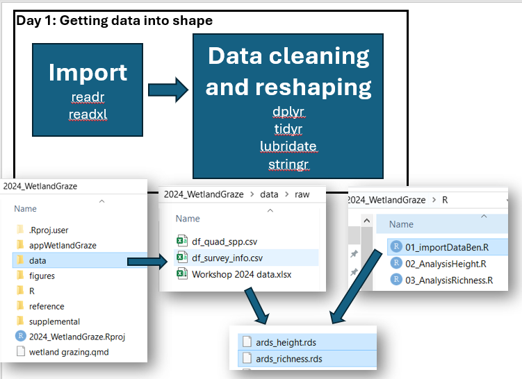
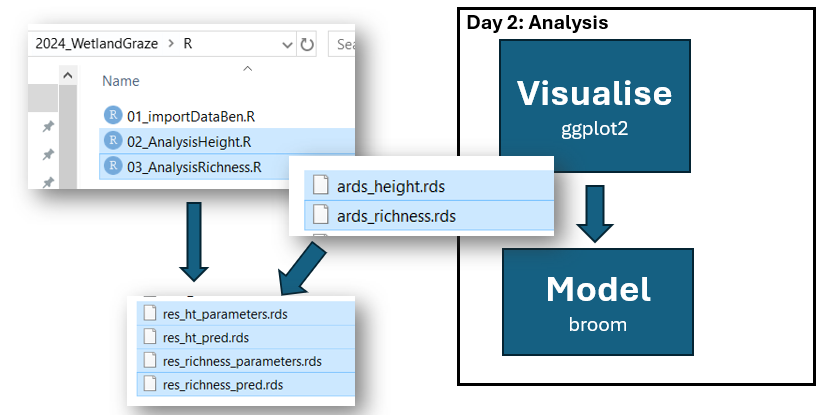
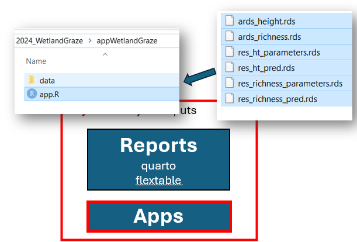
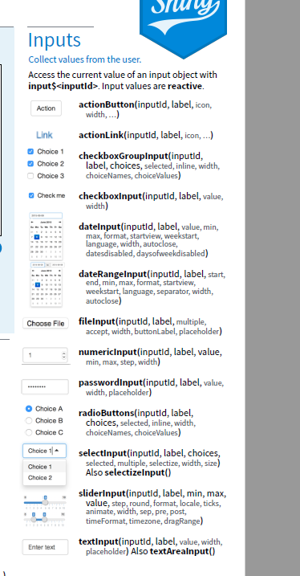
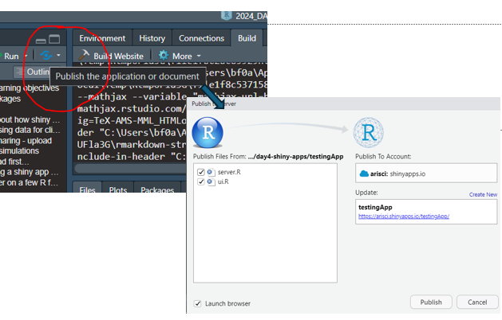
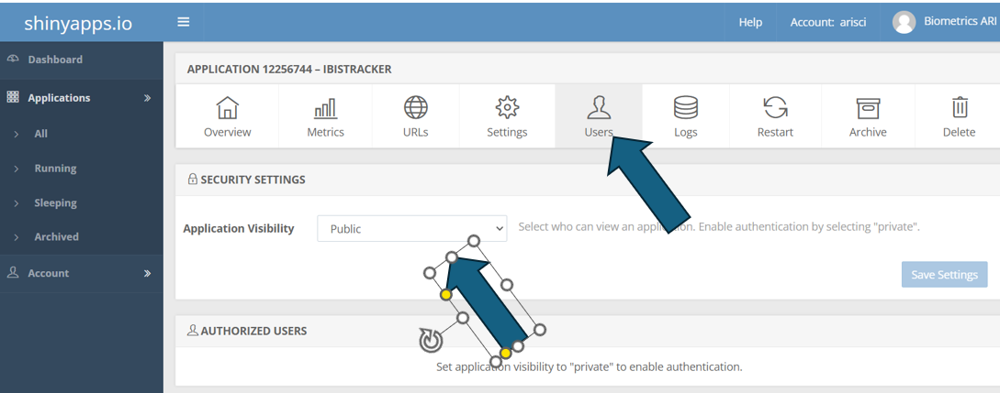

```{r setup, include=FALSE}
knitr::opts_chunk$set(echo = TRUE, collapse = TRUE)
```

[A REMINDER TO HARRIET TO REMIND US TO START RECORDING]{style="color: red;"}

# Before starting

Make sure you have the `shiny` package installed on your computer. You can use code below or the "Packages" tab in lower right panel in Rstudio.

```{r, eval=F}
  install.packages('shiny')  
```

# Day's learning objectives

1)  Have a good understanding of what Shiny apps can do and how it might be useful for you

2)  Understand the core structure of Shiny apps: UI, Server, Input/Output, Reactivity

3)  Learn how to create and run an App locally as well as deploy on ARI's shiny account

4)  Feel **confident enough to grab example code and add to your app** `r emo::ji('crossed_fingers')`

# Key packages

{width="10%"}{width="10%"}

Of course there is cheatsheet to check out...

```{r  eval=T, echo=T, out.width='100%', out.height='250%'}

knitr::include_graphics("shiny.pdf")
  
```

<br> <br> <br> <br> <br> <br> <br> <br> <br> <br>

# Project folder for today

## Download

The Rproject contains everything that we have done, including today.

```{r dwnldProject, eval=T, echo=FALSE, code_folding = FALSE}
library(downloadthis)
  download_link(
    link="https://delwpvicgovau-my.sharepoint.com/:u:/g/personal/ben_fanson_deeca_vic_gov_au/EYLE3zkOD25DrZ9wVFcOcl4Bl2gQ803ZfLssKZMWOuJgyA?e=KHqOJC",
    output_name = "day4Project",
    button_label = "Download Rstudio project",
    button_type = "warning",
    has_icon = TRUE,
    icon = "fa fa-save"
  )
```

For background information on the dataset, see [dataset summary](https://bfanson.github.io/2024_DADA_workshop/dataset.html)

## Quick reminder of the week

As we have progressed throughout the week, we have been building up our Rproject to include all the parts of the workflow we introduced on Day 1.

In Day 1, we created our 1) Rproject, 2) folder structure, 3) stored our data, 4) created `importData.R` script, and 5) saved **A**nalysis **R**eady **D**ata**S**ets (ARDS)



In Day 2, we 1) used the `ards` files to visualise our data, 2) ran statistical models using R scripts, 3) checked models, and then outputted predictions and parameters estimates.

<aside>Ssshhh...I have done a little renaming of files. DON'T TELL PAUL</aside>



In Day 3, we used those result files to produce a Quarto report document.


Today, we take the "last" step (for our workshop) and create a shiny App to provide interactive results.



# Pep talk

Well, I was going to go into basketball coach mode and give a pep talk about shiny looking intimidating, baby steps, etc.. But, I figured if you have made it to this day, nothing will scare you off.

Though I will still say my final note of my pep talk..."Once you get beyond the **foreignness of the code**, we guarantee that with a little guidance, you can easily get started making your own apps in minutes. It is just about **getting the basic structure** and then having the **confidence to do "trial-and-error"** with borrowed code. Just be forewarned, shiny Apps can become addicting!!!"

# Use of AI

I will be using AI a fair a bit today. I have found really useful for getting started with shiny apps and for the basics (mostly what we covering here), it can really help. As noted in other days, it is helpful to have a few terminology/concepts under your belt when working with AI for shiny app creation. I will try to demonstrate this through this session. I will just work with [Copilot](https://copilot.microsoft.com/) (and maybe [Claude](https://claude.ai/new) for comparison?). I have more info in the page on [AI](https://bfanson.github.io/2024_DADA_workshop/d1_ai.html) extra topic.

# Let's build one together

## Go through a simple example

We will work through an example of building a simple app that displays a graph depending on the conditions selected.

I am going to work with the built-in `mtcars` dataset for the example. I want an user to select a the number of cylinders a car has and plot the relationship between horsepower(hp) and fuel efficiency (mpg).

<aside>The use of built-in dataset makes it easy to replicate what we do here and **play around**</aside>

```{r, fig.height=3, fig.width=6}
head(mtcars)

library(ggplot2)
ggplot(mtcars, aes(hp, mpg) ) + geom_point() + geom_smooth(method='lm') +
  facet_wrap(~cyl) + labs(x='hp (horsepower)', y='mpg (mile/gallon)')
```

In Copilot, I typed the following:

> build me a shiny app using the mtcars dataset. The UI will have a side panel that will allow the user to select the cyl type and the main panel will have two tabs. The first tab will show a plot of the relationship between hp and mpg for the cyl selected by the user. The plot will also have the linear regression line and confidence band that was created using lm(). The second tab will have the linear model outputs extracted from the model using broom::tidy()"

The coding output are shown below:

```{r ai_code, echo=T, include=T, eval=F}
# set global objects
library(shiny)
library(ggplot2)
library(broom)

# Define UI
ui <- fluidPage(
  titlePanel("MTCars Analysis"),
  
  sidebarLayout(
    sidebarPanel(
      selectInput("cyl", "Select Cylinder Type:", 
                  choices = unique(mtcars$cyl))
    ),
    
    mainPanel(
      tabsetPanel(
        tabPanel("Plot", plotOutput("hp_mpg_plot")),
        tabPanel("Model Summary", tableOutput("model_summary"))
      )
    )
  )
)

# Define server logic
server <- function(input, output) {
  
  filtered_data <- reactive({
    mtcars[mtcars$cyl == input$cyl, ]
  })
  
  output$hp_mpg_plot <- renderPlot({
    data <- filtered_data()
    model <- lm(mpg ~ hp, data = data)
    
    ggplot(data, aes(x = hp, y = mpg)) +
      geom_point() +
      geom_smooth(method = "lm", se = TRUE) +
      labs(title = paste("HP vs MPG for", input$cyl, "Cylinders"),
           x = "Horsepower (hp)", y = "Miles per Gallon (mpg)")
  })
  
  output$model_summary <- renderTable({
    data <- filtered_data()
    model <- lm(mpg ~ hp, data = data)
    tidy(model)
  })
}

# Run the application 
shinyApp(ui = ui, server = server)
```

It does run successfully and the UI looks like the following:


## Walk through the key bits

### Setting up the app

{width="75%"}

**ONE vs MULTIPLE files**

For your app setup, you can either select a single file called `app.R` [like we did in the example] or you can create two files: `ui.R` and `server.R`. What this is doing is just breaking up the one file into two, otherwise basically the same. The advantage of the latter is in larger apps and for reusing code (modularise). We will stick with one file method for rest of today.

## Structure of the file

Shiny app has a straightforward structure comprising four main components: 1) global heading; 2) `ui`; 3) `server`; and 4) `shinyApp`.

Here is the basic structure, stripping away the guts.

```{r file_str, echo=T, eval=F}

# 1) Define extra packages and global objects (e.g. your dataset, model results, formats...)
library(shiny)
library(tidyverse)


# 2) Define UI for application [how it looks to the user]
ui <- fluidPage(    
  
)

# 3) Define server logic [steps taken when app starts and user clicks something]
server <- function(input, output) {
}

# 4) Run the application 
shinyApp(ui = ui, server = server)

```

Visual model of the file...

{width="95%"}

Let's go through each component...

## UI (= user interface)

This is what the user will be using to explore your data/results/visualizations.

### Step 1: pick a layout for UI

First step is determining what kind of layout you want. Single panel, main panel with sidepanel, tabs. May want to check Shiny [gallery](https://shiny.posit.co/r/gallery/) or [layout](https://shiny.posit.co/r/layouts/) for ideas.

In our example, AI produced the following UI code using `fluidPage()` then breaking into `sidebarLayout()` and then again into `sidebarPanel()` and `mainPanel()`. Within the `mainPanel()` section, it added `tabsetPanel()` to get the tabs.

```{r, eval=F}
# 2) Define UI for application [how it looks to the user]
ui <- fluidPage(
  titlePanel("MTCars Analysis"),
  
  sidebarLayout(
    sidebarPanel(
      selectInput("cyl", "Select Cylinder Type:", 
                  choices = unique(mtcars$cyl))
    ),
    
    mainPanel(
      tabsetPanel(
        tabPanel("Plot", plotOutput("hp_mpg_plot")),
        tabPanel("Model Summary", tableOutput("model_summary"))
      )
    )
  )
)
```

### Step 2: create the inputs objects: buttons, inputs, drop-down menu

Once layout is figured out, now you add in the input objects. In our example that was a drop-down menu that allowed the user to pick cylinder size.

Check the cheatsheet for basic options for inputs or search Shiny [gallery](https://shiny.posit.co/r/gallery/)

{width="45%"}

**Few key takeways**

-   basically creating html using simple functions

-   functions are separated by commas!!!!

-   And so many nested brackets!!!!

## input

{width="50%"}

In the UI, an input list is created from the UI design and it is used to send user inputs to the server.

**Takeways**

-   like an R list

-   setup by the UI

-   can only be changed by the user (immutable from being changed in the server code)

## server

The server is the heart of the app. Let revisit the visual model...

{width="40%"}

Three main key bits...

1.  You have the inputs coming in that will be used

2.  R code that will take the inputs and convert to new output(s)

3.  the output list is created and exported back to UI

Let's look a little closer at the server code

```{r server_code, eval=F}
# Define server logic
server <- function(input, output) {
  
  filtered_data <- reactive({
    filter(mtcars, cyl == input$cyl)
  })
  
  output$hp_mpg_plot <- renderPlot({
    data <- filtered_data()
    model <- lm(mpg ~ hp, data = data)
    
    ggplot(data, aes(x = hp, y = mpg)) +
      geom_point() +
      geom_smooth(method = "lm", se = TRUE) +
      labs(title = paste("HP vs MPG for", input$cyl, "Cylinders"),
           x = "Horsepower (hp)", y = "Miles per Gallon (mpg)")
  })
  
  output$model_summary <- renderTable({
    data <- filtered_data()
    model <- lm(mpg ~ hp, data = data)
    tidy(model)
  })
}

```

**Key takeways**

1.  not separated by commas

2.  more like R programming but **order does not matter** between components!!!!!

3.  Within renderXXX or reactive() we have R code and **order does matter** here. Note the double-brackets needed when multiple lines

## output

Our `server` created `output$hp_mpg_plot` using `renderPlot` and `output$model_summary` using `renderTable` and the `ui` outputs using `plotOutput` and `tableOutput`. You get these pairs of renderXXX({}) and xxxOutput().

```{r, eval=F}
# does not run...just showing R code snippets that pair up
  output$hp_mpg_plot <- renderPlot({...})       # code in server side
  tabPanel("Plot", plotOutput("hp_mpg_plot")) # code in ui side
  
  output$model_summary <- renderTable({...})   # code in server side
  tabPanel("Model Summary", tableOutput("model_summary")) # code in ui side

```

Look at the cheatsheet for a partial list of pairings...

{width="75%"}

Note - this is not a comprehensive list and packages might have then own renderXxx() and xxxOutput()

Couple more examples...

```{r server_leaflet, eval=F}
# leaflet package (see below in the lecture)
  leaflet::renderLeaflet()   # server side for leaflets
  leaflet::leafletOutput()   # UI side for leaflets
  
# plotly package (see below in the lecture)  
  renderPlotly()  # server side for plotly
  plotlyOutput()  # UI side for plotly
  
```

# A few tips on debugging

-   work in steps

-   to test UI, you can often comment out all of the server content

-   once you got UI working, work on the server

-   with server, you can create temporary substitutes variable to test the code:

    ```{r eval=F}
    #example testing parameters 
    input <- list(cyl=6)
    filtered_data <- function() filter(mtcars, cyl==input$cyl)


    ```

# Little more on the server side

## Reactivity

The style of programming used in shiny apps is called "reactive programming". The purpose of this programming style is to keep inputs and outputs in sync. To do this efficiency, you only want to update outputs that need to be changed. So the rule is "change ***if and only if*** inputs change".

In our example we had one such case. This reactive function was then used in both renderXXX functions.

```{r, eval=F}
  filtered_data <- reactive({
    filter(mtcars, cyl == input$cyl)
  })
  

```

The two key components of this are called:

-   **lazy** - only do work when called to ["procrastinate as long as possible"]

-   **cache** - save the results produced when first called and use that until something changes

You will see a variety of functions that are doing "extra" bits in the programming:

```{r reactive, eval=F}
  shiny::reactive()        # create function for repeated active (e.g. filtering dataset for multiple outputs )
  shiny::reactiveValues()  # create a new reactive "list" like input and output
  shiny::observe()         # performs a side effect, changes to input changes
  shiny::observeEvent()    # performs when an event happens like submit button (e.g. input/output)
  
```

We will not go into depth here but just want you to be aware and when you see them, know that they are doing extra stuff and a bit of efficiency stuff. For more complicated/sophisicated apps, they are essential to get a handle of.

# Let's try an analogy

Here is an analogy that I came across that hopefully helps. Think of the app as a restuarant...

1.  **UI (User Interface)**: Think of this as the **menu** of the restaurant. It lists all the dishes (inputs and outputs) that the customers (users) can choose from.

2.  **Server**: This is the **kitchen** where all the cooking happens. The chefs (server functions) take the orders (inputs) from the customers and prepare the dishes (outputs). The kitchen processes the raw ingredients (data) and transforms them into delicious meals (results).

3.  **Reactive Expressions**: These are like the **recipes** that the chefs follow. They define how to prepare each dish based on the ingredients and cooking methods. If an ingredient changes, the recipe ensures the dish is updated accordingly.

4.  **Reactive Values**: These are the **ingredients** in the kitchen. They can be fresh produce, spices, or any other items that the chefs need to prepare the dishes. If the ingredients change, the dishes will also change.

5.  **Observers**: These are like the **waitstaff** who keep an eye on the dining room. They monitor the customers and ensure that their needs are met promptly. If a customer needs something, the waitstaff (observers) take action to address it.

# Deploy your App

## ARI shiny account

Thanks to Nev and Jim in particular `r emo::ji('clap')`, we now have a ARI shiny **Professional** account (called *arisci)*. This account is available to all ARI staff though we do have limits on the number of account users (max = 25 user accounts) but it can have an unlimited number of apps and has 10,000 usage hours (per month). The shiny apps are hosted on <https://www.shinyapps.io/> and have [https://**arisci.shinyapps.io**/XXAppNameXX](https://arisci.shinyapps.io/XXAppNameXX__){.uri} address (e.g. <https://arisci.shinyapps.io/ibisTracker/>).

Nev/Jim have created a live [document](https://delwpvicgovau-my.sharepoint.com/personal/nevil_amos_deeca_vic_gov_au/Documents/shinyapps.io%20account%20user%20guide.docx?web=1) detailing the process. I will go key aspects below.

### Setting up a shiny account

1.  Chat with others in your area and decide whether it may be useful to have a program-wide (similar) account for multiple users. If you are likely a higher user, it may be best to have your own account. If just playing around, you can get a few account on [shiny.io](https://www.shinyapps.io/)

2.  Email Jim Thomson ["The Gatekeeper"] requesting

3.  You will receive an invite to create an account. For your account, you will use your email (or designated person) as the username and then set a password

## linking your Rstudio to shiny server

All account holders can access all the apps on the shared account. To ensure that you do not mess with other user's apps accidentally **please use the rsconnect package for all you uploading, modification, archiving and deletion of apps** -- your connection will have its own token. See detailed [info](https://cran.r-project.org/web/packages/rsconnect/readme/README.html).

Click here for [step-by-step](https://statsandr.com/blog/how-to-publish-shiny-app-example-with-shinyapps-io/). Overview is shown below:

{width="100%"}

If you prefer, you can use rsconnect package via code. Get the name, token, and secret info from the token page when logged into <https://www.shinyapps.io/>.

```{r eval=F}
rsconnect::setAccountInfo(name='arisci',
 			                    token='XXXXX',
                   			  secret='XXXXX' )  
```

## Deploying your app

You can use the publish approach via Rstudio (GUI approach):



Or you can do the rsconnect way (just make sure the current directory is where the app is or you need to specify location)

```{r eval=F, collapse=F}
# from current directory
rsconnect::deployApp( )  

# or if in a different directory, specify the directory

rsconnect::deployApp('app/appAmazing' )  

```

## Archiving/deleting your app

To prevent deleting of others apps, you should **archive/delete the app using rsconnect code below**. You can just type into Rconsole and run, assuming that you have setup your shiny connection (as shown above). You first need to archive the app and then delete:

```{r eval=F, collapse=F}
rsconnect::terminateApp(appName = 'appName')  # this will archive the app.
rsconnect::purgeApp(appName='appName')        # this will delete it off the server 
```

## Publishing *Public* apps

Check Nev/Jim live [document](https://delwpvicgovau-my.sharepoint.com/personal/nevil_amos_deeca_vic_gov_au/Documents/shinyapps.io%20account%20user%20guide.docx?web=1) on the current process for this.

## Public/private settings

You can do via deployApp:

```{r eval=F, collapse=F}
rsconnect::deployApp(appDir = "your app", appVisibility = "private")

```

Or you can go onto shiny.io 1) go to your app info; 2) click on users, and 3) finally public.



If private, you will need to authorise users which you can do using below:

```{r, eval=F}
# you can add specific users
rsconnect::addAuthorizedUser(email= user@emailaddress.com)
```

If the user does not have an account on shinyApps.io they will need to create one. They will be sent an email with an invitation link.

# Shiny Extensions

As noted about, search the Shiny [gallery](https://shiny.posit.co/r/gallery/) to get ideas of additional options of what you can do. On this website, it provides all the ui/server code on a GitHub repository, so you can just grab the code.

Another good place to search for additional extensions for shiny is [Shiny Awesome](https://github.com/nanxstats/awesome-shiny-extensions) which has a curated list and some of the stuff, is well, awesome! (and overwhelming) The links often lead you to GitHub pages.

# Useful interactive packages for shiny

As Shiny apps are all about interactivity, you may want to use interactive plots. Check the following [webpage](https://r-graph-gallery.com/interactive-charts.html) for a examples of packages that have interactivity.

I will show some interactive figures that might be of interest below:

## leaflet

### `mapview` package

The mapview package can be used to set up a simple, quick leaflet. This would be most useful when the leaflet is created on startup (not adding in reactivity like adding or deleting data being shown). For instance, you might want to show all the sites surveyed and attach metadata (e.g. dates surveyed, number of fish caught, number of plots) to that point.

```{r mapview_ex}
# example using built-in dataset
  library(mapview)
  mapview::mapview(breweries)

```

Useful shiny functions for Server/UI...

```{r mapview_out, eval=F, collapse=F, echo=T, include=T}
# how it is supposed work
  mapview::renderMapview()  # server side
  mapview::mapviewOutput()  # UI side
  
# I have issues and used leaflet instead example below
  sf_m <- mapview::breweries
  your_map <- mapview::mapview(sf_m)
  output$map <- leaflet::renderLeaflet(your_map@map)  # grabs the leaflet
# then you  - server side
  leaflet::leafletOutput( 'map' ) # UI side
```

### `leaflet` package

Now, if you are going to build maps that will change with user input, it is best to build from "scratch" using `leaflet` package (and probably `leaflet.extra` package + others)

When you have user inputs affecting the map shown, you want to try to avoid rebuilding the map object and rather just modify the elements that the user wants changed (e.g. drop lines and add points instead). This requires using reactive programming and `observe()` functions. Check out Nev's [ibis app](https://arisci.shinyapps.io/ibisTracker/) that does this.

Useful shiny functions for Server/UI...

```{r leaflet_out, eval=F, echo=T, include=T}
  leaflet::leafletOutput()  # UI side
  leaflet::renderLeaflet()  # server side - creates the basemap
  leaflet::leafletProxy()   # this is the server function that updates the map 

```

## plotly

Now, `plotly` package does a great job at interactive plots. You can write you code in ggplot and then just convert as shown in code below.

```{r out.height='500px', out.width='500px', echo=T, include=T}
  library(ggplot2)
  library(plotly)
  f <- ggplot( cars, aes(speed, dist)  ) + geom_point() + geom_smooth()
   plotly::ggplotly(f)

```

<br>

Useful shiny functions for Server/UI...

```{r plotly_out, eval=F, collapse=F, echo=T, include=T}
  plotly::renderPlotly()
  plotly::plotlyOutput()
  
```

## ggiraph

Again, you can build your plots using ggplot and convert. I like this one for linking up plots...below, put your cursor over a dot on the left or a bar on the right. If you know CSS, it can be pretty powerful...

```{r ggiraph_ex, include=T, echo=T, include=T}
library(ggiraph)
library(tidyverse)
library(patchwork)

mtcars_db <- rownames_to_column(mtcars, var = "carname")

# First plot: Scatter plot
fig_pt <- ggplot(
  data = mtcars_db,
  mapping = aes(
    x = disp, y = qsec,
    tooltip = carname, data_id = carname
  )
) +
  geom_point_interactive(
    size = 3, hover_nearest = TRUE
  ) +
  labs(
    title = "Displacement vs Quarter Mile",
    x = "Displacement", y = "Quarter Mile"
  ) +
  theme_bw()

# Second plot: Bar plot
fig_bar <- ggplot(
  data = mtcars_db,
  mapping = aes(
    x = reorder(carname, mpg), y = mpg,
    tooltip = paste("Car:", carname, "<br>MPG:", mpg),
    data_id = carname
  )
) +
  geom_col_interactive(fill = "skyblue") +
  coord_flip() +
  labs(
    title = "Miles per Gallon by Car",
    x = "Car", y = "Miles per Gallon"
  ) +
  theme_bw()

# Combine the plots using patchwork
 combined_plot <- fig_pt + fig_bar + plot_layout(ncol = 2) 

# Combine the plots using cowplot
# combined_plot <- cowplot::plot_grid(fig_pt, fig_bar, ncol=2) 

# Create a single interactive plot with both subplots
interactive_plot <- girafe(ggobj = combined_plot)

# Set options for the interactive plot
girafe_options(
  interactive_plot,
  opts_hover(css = "fill:cyan;stroke:black;cursor:pointer;"),
  opts_selection(type = "single", css = "fill:red;stroke:black;")
)
```

<br>

Useful shiny functions for Server/UI...

```{r ggiraph_out, eval=F, echo=T, include=T}
  ggiraph::renderGirafe()
  ggiraph::ggiraphOutput()
  
```

# Let's get our hands dirty...

::: {#task .greeting .message style="background: lightgrey;"}
**Option 1: Build your first app**

-   create a shiny app using dropdown menu in the Rproject [as we did above] -
-   copy the `mtcars` app code we used above and paste it in
-   run the app [highlight and run all code or click `Run App`]
-   now, have fun and play around
    -   try changing the type on input: checkbox, radio button [see the cheatsheet]
    -   Instead of using cyl, use another column as the input
    -   change your ggplot options
    -   add a new tab to show the raw data
:::

<br>

::: {.greeting .message style="background: lightgrey;"}
**Option 2: Run the appWetlandGraze in the Rproject**

-   Download the Rproject and put in your preferred location
-   Double-click the `2024_WetlandGraze.Rproj` to open the project
-   Open the `appWetlandGraze/app.R` file in Rstudio
-   Notice the AI prompt that I used to get started.
-   Run the app - Play around with the interface [brake it and then fix it]
:::

<br>

::: {.greeting .message style="background: lightgrey;"}
**Option 3: Construct your own app from scratch**

-   use their the `2024_WetlandGraze` project or built-in dataset
-   figure out what you want your app to show
-   try to use a AI prompt to get you started or check out the shiny galleries and grab that code
-   think about your layout: side panel, tabs, types of input options
-   what renderXxx() and xxxOutput() functions will your need?
:::

# Additional resources

For useful resources: <https://shiny.posit.co/r/articles/>

Good for basic shiny <https://mastering-shiny.org/>

For high level apps, [Engineering Production-Grade Shiny Apps](https://engineering-shiny.org/index.html)
