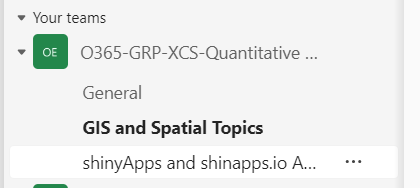

```{r setup, include=FALSE}
knitr::opts_chunk$set(echo = FALSE)
```

# What the workshop is trying to do

-   Become familiar with data analyst workflow
-   Learn a workflow from data cleaning to analysis to presenting/communicating results in one platform
-   Increase your knowledge about the R workflow, resources, and capabilities `r emo::ji("+1")`

# What is it **NOT** trying to do

-   Turn you into a R programmer/Shiny app developer in 4 days
-   Going in-depth into any specific topic (except R workflow)
-   Make you cry `r emo::ji("cry")`

------------------------------------------------------------------------

# Learning objectives

1)  Understand "modern" workflow using R environment

2)  Identify what R packages are routinely used for each analysis steps

3)  Improve your workflow efficiency, reproducibility, and "general sanity"

4)  Have a resource to reference when stuck or need to refresh memory

------------------------------------------------------------------------

# Workshop Structure

This is 4-day workshop with each day running from 9am-12pm. During each day's session, we will cover a new topic in the workflow pipeline.

+  Monday 2024SEP16: Overview of workflow, importing, cleaning

+  Tuesday 2024SEP17: Analysis of data

+  Wednesday 2024SEP18: Creating reports

+  Thursday 2024SEP19: Creating shiny Apps


Within each day, the session is structured to be mainly talk and chalk for the first half and then more hands-on for the second half.  

**Note** - We will not be offended if you just stay for the first half


**Importantly, tea will be provided!! `r emo::ji("happy")`**

------------------------------------------------------------------------

# What to expect

## Approach

Compared to when we started providing biometrics workshops, the amount of resources and online learning tools has exploded. Partly as a consequence, there has been a homogenization of workflow driven by key leaders in the area that have pushed the technology and analysis paradigms.

Given this, we will attempt in this workshop to act more as a guide to help you develop a solid framework that you can use as a launching point. We will point out amazing resources out but also hoping that workshop will give you the foundation to dive deeper into the topics specific to your research/needs.


## May need to take a step-back at times

For some, the last two days of the workshop might push their limits but they are important skills to develop as how we communicate research (and the expectations) is changing quickly.

On Day 3 (creating reports), the Quarto(/Rmarkdown) approach takes a bit to get used to if you are WYSIWYG (**W**hat **Y**ou **S**ee **I**s **W**hat **Y**ou **G**et).  The key is focus on the higher level concepts (e.g. how it could be useful for you, focus on the higher level concepts (e.g. losing the forest for the trees)).  Most importantly, once you have a template to work from and understand a key fundamentals, you can modify easily (often having no clue how most of it works...my approach for years (still?) to be honest).

Now, for Day 4 (Shiny Apps), Shiny is going to look (frustratingly/scaredly/freakishly) different as shown below (heads up):

```{r shine_ex, include=T, echo=T,eval=F, collapse=T}
library(shiny)

# Define UI for application that draws a histogram
ui <- fluidPage(
  fluidRow( 
    selectInput('x','X-Variable', choices = names(mtcars)),
    selectInput('y','Y-Variable', choices = names(mtcars)),
    plotOutput('plot') 
)
)
# Define server logic required to draw a histogram
server <- function(input, output, session) {
  output$plot <- renderPlot({
    plot( mtcars[,input$x], mtcars[,input$y] )
    
  })
}# Run the application 

shinyApp(ui = ui, server = server)
```

However, shiny apps have a very basic structure and once you get that (and a few other key bits), you can often grab other people's code and modify slightly to get what you need.

Reminder - The goal here is __not to make you a programmer__ but familiar with a few key tools so that you can tinker away.


------------------------------------------------------------------------

# Plug for QEARI

Just a reminder QEARI (**Q**uantitative **E**cology **ARI**) is a great resource and a safe place for asking "dumb" questions. The amount of expertise among its regulars is impressive! There are multiple channels to ask questions including a **new one for shiny Apps**!!!

{width="50%"}


------------------------------------------------------------------------

# What to do when my brain hurts...

Zen out while checking out the 367 Collins Peregrines....

<iframe width="657" height="370" src="https://www.youtube.com/embed/VLLNNTjaSEA" title="367 Collins Falcons 2024 - South facing" frameborder="0" allow="accelerometer; autoplay; clipboard-write; encrypted-media; gyroscope; picture-in-picture; web-share" referrerpolicy="strict-origin-when-cross-origin" allowfullscreen>

</iframe>

<br>
