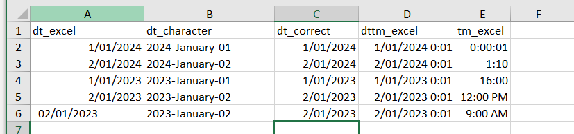

```{r setup, include=FALSE}
knitr::opts_chunk$set(echo = TRUE)
library(tidyverse)
```

# Date/time


```{r cheatsheet, eval=T, echo=F, out.width='100%', out.height='200%'}
  knitr::include_graphics("pdfs/lubridate.pdf")
```

<br> <br> <br> <br> <br> <br>

## Key date concepts

Below contain some examples of key concepts.

### date using lubridate

```{r dt_basic, eval=T, code_folding=F}

# tidy way to make a date
  as_date('2001-01-01') # assume Year-month-day
  ymd('2001-01-01')  # better to be specific about date format using helper function
  dmy('01-01-2021') # date the other way
  dmy('01-JAN-2021') # date the other way
  
# dates are stored as number of days since 1970-01-01 (julian days) in R 
  dt <- as_date('1970-01-01')
  class(dt)
  as.numeric(dt)  # days since 1970-01-01 is zero
  as_date('2024-01-01') %>% as.numeric() # 19,723 days since that reference date
```

Let's read in the following excel file...



We will do this using `lubridate` functions

<br>

``` {r dt_excel, eval=T, code_folding=F}
# EXCEL WARNING: dates are stored as number of days since 1899-12-30 in Excel [leap year bug in Lotus]
  ds <- readxl::read_excel('data/raw/date_example.xlsx') %>% select( starts_with('dt_') )
  head(ds)  # notice the mix of numbers and text...[reminder: databases as so much better than excel]
            # notice the <s3: POSIXct> column type
  ( v_dt <- slice_head(ds, n=4 ) %>%  # example of slice function that grabs first 4 rows 
              pull(dt_excel) %>%  # example of using pull to grab a certain column
              as.numeric() )  # 
  as_date(v_dt)  # obviously wrong because it is using 1970-01-01 as the reference date
  as_date(v_dt,origin='1899-12-30') 
  
  # switch from POXICxt to Date
  mutate(ds, dt_correct = as_date(dt_correct) ) # now it is <date>
  
  # for those interested, one possible fix to the column
  mutate(ds, dt_fixed = case_when( !is.na(as.numeric(dt_excel)) ~ as_date( as.numeric(dt_excel), origin='1899-12-30'),
                                   TRUE ~ dmy( dt_excel)  ) )
  # what does AI do? Try "using tidyverse in R, how can I fix a dataset that has a column that is text that needs to be converted to date but the column has julian days as well as date character formats in it?"
  
```

<br>

```{r dt_helpers, eval=T}
# lots of useful date helpers in lubridate  
  dt <- as_date('2024-09-16')
  year(dt)  # year
  month(dt) # month
  week(dt)  # week in the year
  wday(dt)  # day in the week (monday=2)
  yday(dt)  # day in the year
  leap_year(dt)  # is this year a leap year?
  
# tip using built in month vectors
    month.abb[ month(dt) ] # example to get the month abbreviation
    month.name[ month(dt) ] # example to get the month fullname

  
```

### lubridate vs. base

Of course, there was a base way of making `as.Date()`. `as_date()` was created to fix a few pitfalls with as.Date(), so it is safer/better to just use `as_date()`

```{r dt_base_tidy, eval=F}
# tidy vs base...  
  as_date('01-11-2021')  # gives error - tidyverse
  as.Date('01-11-2021')  # note the issue - base R

# note assumptions still happen but tidy is a bit safer  
  as_date('01-01-01') # assumes Year-month-date and that we are 20XX
  as.Date('01-01-01') # no chance of correct
  
  dmy('01-11-2021')  # can you the helper functions to convert
  as_date('01-11-2021', format='%d-%m-%Y') # or add a format for those inclined
  ?strptime  # one place to find format codes
  # copilot - try "what is the date format code for 01-nov-2022 using R"  
  
# timezone stuff-ups  
  dt_utc <- ymd_hms("2024-09-01 00:50:50")
  dt_europe <- ymd_hms("2024-09-01 00:50:50", tz = "Europe/London")
  c(as_date(dt_utc), as.Date(dt_utc))
  c(as_date(dt_europe), as.Date(dt_europe) )

  as.Date(dt_europe, tz= tz(dt_europe) ) # have to grab the tz explicitly
  
  
```


## Key datetime concepts

It is very analogous to date concepts so let's mirror our previous steps

```{r dt_basics}

# tidy way to make a datetime
  as_datetime('2001-01-01 10:00:00') 
  ymd_hms('2001-01-01 10:00:00')  # better to be specific using helper function
  dmy_hm('01-Nov-2001 10:00')  # better to be specific using helper function

# dates are stored as number of seconds since 1970-01-01 00:00:00 in R 
  dttm <- ymd_hms('1970-01-01 00:00:60')
  as.numeric(dttm)  # 60 seconds

# however, dates are stored as number of days since 1899-12-30 in Excel [leap year bug in Lotus]
  # ds <- readxl::read_excel('data/raw/date_example.xlsx') %>% select( contains('tm_'))
  # head(ds)  # notice the mix of numbers and text...[reminder: databases as so much better than excel]
  #           # notice the <s3: POSIXct> column type
  # ( v_dt <- slice_head(ds, n=4 ) %>% pull(dttm_excel) %>% as.numeric() )
  # as_date(v_dt)  # obviously wrong because it is using 1970-01-01 as the reference date
  # as_date(v_dt,origin='1899-12-30') 
  # 
  # # switch from POXICxt to Date
  # mutate(ds, dt_correct = as_date(dt_correct) ) # now it is <date>
  # 
  # # for those interested, one possible fix to the column
  # mutate(ds, dt_fixed = case_when( !is.na(as.numeric(dt_excel)) ~ as_date( as.numeric(dt_excel), origin='1899-12-30'),
  #                                  TRUE ~ dmy( dt_excel)  ) )
  # what does AI do? Try "using tidyverse in R, how can I fix a dataset that has a column that is text that needs to be converted to date but the column has julian days as well as date character formats in it?"
  
```

## Timezones

When working with timezone daylight savings can be problematic.  Depending on project, I often just work with Brsibane timezone that has no daylight savings:

```{r}
  timezone_aedt <- 'Australia/Melbourne' # AEDT with daylight savings
  timezone_aest <- 'Australia/Brisbane'  # AEST with no daylight savings

  dttm <- ymd_hms('2024-10-16 12:00:00') # note UTC
  dttm
  
  with_tz(dttm, timezone_aedt)
  with_tz(dttm, timezone_aest)

```


